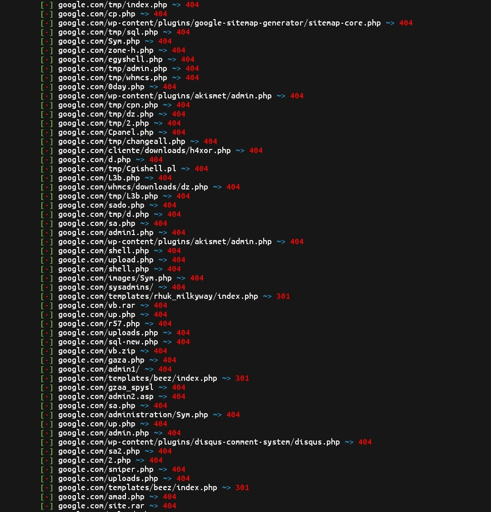

<p align="center">
<a href="mailto:developer.ramiwzayed@gmail.com"></a>
<a href="https://github.com/ramiwzayed/AdminHack"></a>
<a href="https://github.com/ramiwzayed/AdminHack/blob/main/LICENSE"></a>
<a href=""></a>
<a href="https://github.com/ramiwzayed"></a>
<a href="https://github.com/ramiwzayed"></a>

</p>

<p align="center">
• <a href="https://github.com/ramiwzayed/AdminHack/blob/main/LICENSE">License</a> 
• <a href="https://github.com/ramiwzayed/AdminHack/issues">Issues</a> 
• <a href="https://github.com/ramiwzayed">Developer</a> 
• <a href="https://github.com/ramiwzayed/AdminHack/wiki">Wikipedia</a> •

</p>


**A script to find admin login pages and EAR vulnerabilites.**

> I am not responsible for your actions.  By downloading software from this repository, you agree to the [license](https://github.com/ramiwzayed/AdminHack/blob/main/LICENSE).

#### Features
- [x] Multi-threading on demand
- [x] Big wordlist list (31371 patch)
- [x] Supports php, asp and html extensions
- [x] Checks for potential EAR vulnerabilite
- [x] Support for custom patns
- [x] Web Crawling
- [x] Checks for robots.txt
- [x] Saving results to file

---
### Installing for linux

* `apt update`
* `apt upgrade`
* `apt install git`
* `git clone https://github.com/ramiwzayed/AdminHack`
* `cd AdminHack`
* `bash setup.sh`


#### Everything is ready! Now we are waiting for everything to download!
 * `success`

## Start Program
#### Enter a command to start AdminHack.

* `bash AdminHack.sh`

#### If there are problems then look down there will be if failed to download.

<details id="missing-code-coverage">
  <summary>Need Help</summary>

#### Do you need help? Write me on: developer.mishakorzhik@gmail.com 
#### And I will consider your letter and problem!

```bash
Email:
ramiwzayed@gmail.com
```
</details>

---

**Repository Views** 


## Screenshot

#### here you can see a screenshot of AdminHack
<br>
<p align="center">
 

</p>

###### By ramiwzayed: Report bug: ramiwzayed@gmail.com

## I recommend watching

1.<a href="https://github.com/ramiwzayed/qiq">qiq - Useful batch installer</a> <br>
2.<a href="https://github.com/ramiwzayed/Gmail-Hack">Gmail-Hack - Easy email hacking</a> <br>
3.<a href="https://github.com/ramiwzayed/AllHackingTools">AllHackingTools - system for large hacking</a> <br>
4.<a href="https://github.com/ramiwzayed/Infect">Infect - Easy virus creation</a> <br>
5.<a href="https://github.com/ramiwzayed/Free-Proxy">Free-Proxy - Lots of free proxy servers</a> <br>
6.<a href="https://github.com/ramiwzayed/IpHack">IpHack - Easy Tracking smartphones</a> <br>
7.<a href="https://github.com/ramiwzayed/UserFinder">UserFinder - Find users in social</a> <br>
8.<a href="https://github.com/ramiwzayed/Ultra-DDos">Ultra-DDos - Hing ddos bad sites</a> <br>

</p>

## Supporters
[](https://github.com/ramiwzayed/AdminHack/stargazers)
[](https://github.com/ramiwzayed/AdminHack/members)

